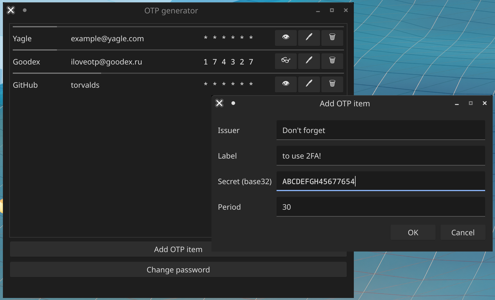

# OTP codes generator

A simple desktop application for generating OTP codes.



## Motivation

I just wanted use an open-source OTP application on my desktop, and it seems that there were no good options. Alternatives explored:

- [WinAuth](https://github.com/winauth/winauth) - unmaintained (latest release 3.5.1 on Oct 25, 2017; repository is archived); Windows-only
- [LinOTP](https://github.com/linotp/linotp) - does not provide either Windows pre-built binaries or at least build instructions for this OS (it seems that LinOTP only supports Linux). It also looks like a more enterprise-oriented solution, not a customer one, and it is an overkill for my purposes.
- [andOTP](https://github.com/andOTP/andOTP), [FreeOTP](https://github.com/freeotp/freeotp-android) - mobile applications only
- [Authy](https://authy.com) - proprietary (or at least I was unable to find the application's source code)

## How to build

### Requirements

- [CMake](https://cmake.org/) 3.19 or newer
- A compiler with C++20 support
- PkgConfig (is used to find some dependencies)

### Dependencies

- [qt5-base](https://github.com/qt/qtbase)
- [liboath](https://www.nongnu.org/oath-toolkit)
- [yaml-cpp](https://github.com/jbeder/yaml-cpp)
- [ntc-cmake](https://github.com/kovdan01/ntc-cmake). It is bundled in this repository as a submodule (see `cmake/ntc-cmake` directory).

### Build instructions

Download the code and make sure that `cmake/ntc-cmake` directory contains [ntc-cmake repository](https://github.com/kovdan01/ntc-cmake) contents.

```
cmake -S . -B build -D CMAKE_BUILD_TYPE=Release
cmake --build build --target install --config Release
```

If some of dependencies are installed in non-standard prefixes, provide path(es) to them in `-D CMAKE_PREFIX_PATH` as a semicolon-separated list. If you want to install the application to a non-standard prefix, provide it with `-D CMAKE_INSTALL_PREFIX` option. Example:

```
cmake \
    -S . \
    -B build \
    -D CMAKE_BUILD_TYPE=Release \
    -D CMAKE_PREFIX_PATH="/path/to/liboath/prefix;/path/to/yaml-cpp/prefix" \
    -D CMAKE_INSTALL_PREFIX=/path/to/desired/prefix
```
